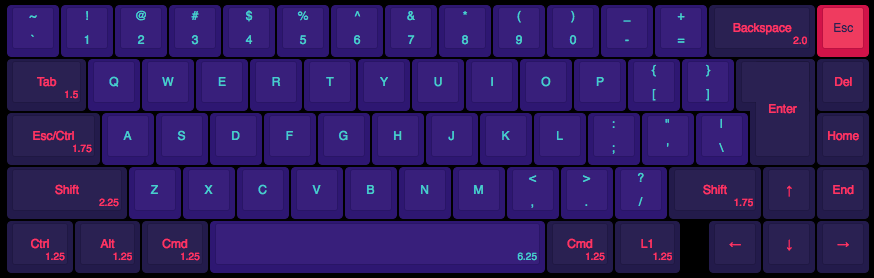
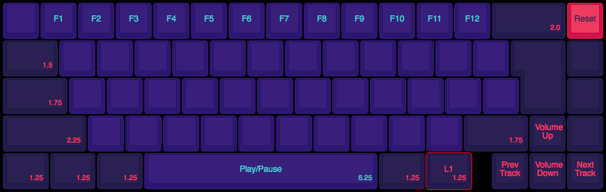

# daviesjamie's custom CU65 layout

I like a fat left shift, like in ANSI. But I also like a tall enter, like in
ISO (it's the best). The CU65 allows me to have both.

This is my custom layout, which is more-or-less exactly what you'd expect with
a few convenience mappings:

* Top-left key is grave/tilde, not escape
* Top-right key is mapped to escape, although I don't use this much
* Caps lock is remapped to escape when tapped and left control when held
* It's in mac layout - alt is between ctrl and GUI (cmd), rather than next
  to space
* Second layer (accessed by pressing the key next to the arrow key cluster)
  allows easy access to:
  * F1-F12 function keys (number row)
  * Media/volume keys (arrow keys and space)
